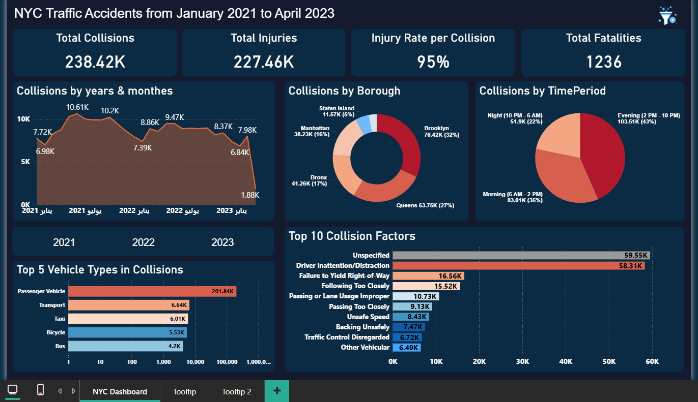

# NYC Traffic Accidents Dashboard | Power BI

## Project Overview
This project is an interactive Power BI dashboard analyzing traffic accidents in New York City from January 2021 to April 2023.  
The dashboard highlights collision trends, injury rates, fatalities, contributing factors, and accident distribution across boroughs and time periods.

## Objectives
- Analyze traffic collision trends over time  
- Identify high-risk boroughs and time periods  
- Understand the main causes of accidents  
- Explore vehicle types involved in collisions  
- Support safety planning and data-driven decision-making  

## Key KPIs
- Total Collisions: 238.42K  
- Total Injuries: 227.46K  
- Injury Rate per Collision: 95%  
- Total Fatalities: 1236  

## Analysis Covered
- Collisions by year and month  
- Collisions by borough  
- Collisions by time period (Morning, Evening, Night)  
- Top contributing factors for accidents  
- Top vehicle types involved in collisions  

## Key Insights
- Evening time period shows the highest number of collisions  
- Brooklyn and Queens record the highest accident volumes  
- Driver inattention and distraction are major contributing factors  
- Passenger vehicles are involved in the majority of accidents  
- Injury rate is significantly high compared to total collisions  

## Business Value
- Helps identify high-risk locations and time periods  
- Supports traffic safety initiatives and awareness programs  
- Enables authorities to prioritize accident prevention strategies  
- Assists in resource allocation for emergency response and road safety planning  

## Tools Used
- Power BI  
- Excel / CSV dataset  

## Dashboard Preview

